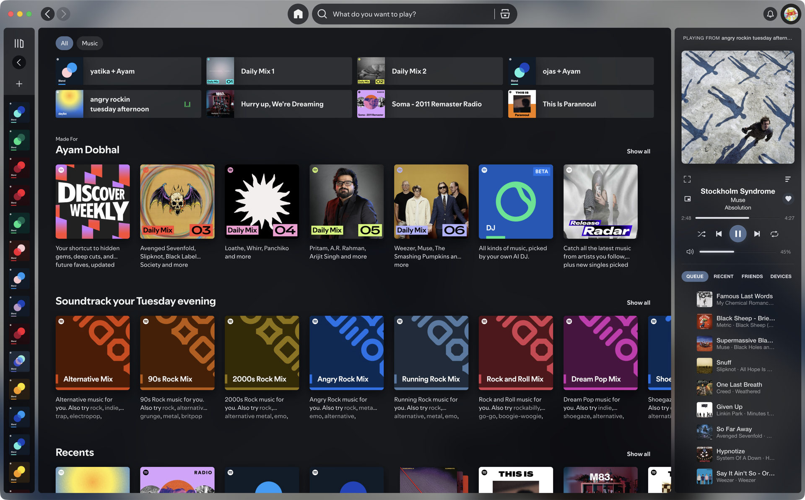
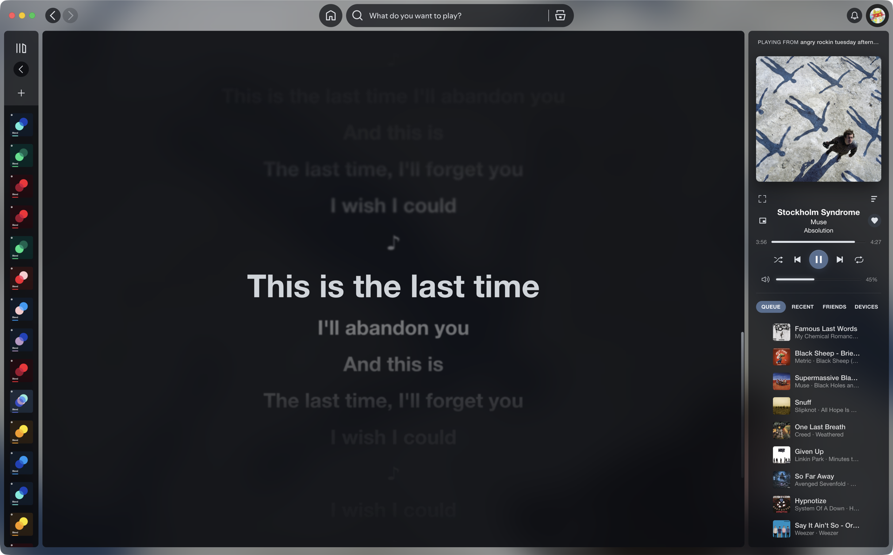

# aurora

**Let the album set the mood.**

Aurora is a [Spicetify](https://spicetify.app) theme and extension bundle for Spotify desktop. Album artwork colors the interface, lyrics follow the music, and a compact player keeps your queue, friends and devices close.

[Install](#install) · [Make it yours](#make-it-yours) · [Keyboard shortcuts](#keyboard-shortcuts) · [Development](#development) · [Changelog](CHANGELOG.md)



## Made for listening

- **An interface that follows your music.** Glass surfaces, artwork-derived accents and smooth background transitions, with readable controls and support for reduced motion.
- **Lyrics with room to breathe.** Word-by-word highlighting where available, line seeking, adjustable timing and a distraction-free focus mode.
- **Your player, in one place.** Queue, Recent, Friends and Devices sit beneath the artwork. Drag queued tracks to reorder them, or open the floating miniplayer to keep listening while you work.
- **Listening together.** Start or manage a Jam inside Friends. Share an invite link or show a QR code for someone nearby to scan.
- **A layout that stays yours.** Resize either sidebar by its inner edge. Aurora remembers your player width, sidebar tab, miniplayer setup and lyrics preferences.



## Install

You’ll need Spotify desktop and a working [Spicetify installation](https://spicetify.app). Run Spicetify at least once before installing Aurora. No Node.js or build tools are needed for these installers.

**macOS / Linux**

```sh
curl -fsSL https://raw.githubusercontent.com/ayamdobhal/aurora/main/install.sh | bash
```

**Windows — PowerShell**

```powershell
iwr -useb https://raw.githubusercontent.com/ayamdobhal/aurora/main/install.ps1 | iex
```

The installers download the latest published build, use your active Spicetify config, preserve unrelated extensions and apply Aurora. They also print the installed source revision. Re-run the same command to update. Applying a theme may restart Spotify, so choose a convenient moment.

Prefer a specific version? Download `aurora.tar.gz` or `aurora.zip` from [Releases](https://github.com/ayamdobhal/aurora/releases). Source builds and deployment details are in the [developer guide](docs/DEVELOPMENT.md).

To return Spotify to its original appearance:

```sh
spicetify restore
```

## Make it yours

### Lyrics

Open lyrics with the button on the player or **F2**. Hover over the top of the lyrics pane to reveal the controls; keyboard focus reveals them too.

**Auto** checks AMLL, lrclib and Spotify together, choosing word-timed lyrics over line-timed lyrics, then plain text. You can also choose a source yourself. Use **− / +** to adjust timing in 50 ms steps, **Reset timing** to undo an adjustment, or **Retry** to request fresh lyrics. Timing is saved separately for each track.

Click a lyric line to seek to it. Scroll to read ahead without being pulled back; **Back to current line** resumes following. **F3**, or the player’s focus button, hides the surrounding panels. **Escape** brings them back.

### Sidebars and miniplayer

Drag the inner edge of the library or player panel to change its width—there are no extra handles on screen. Double-click the player edge to reset it. The edge also supports arrow keys when focused.

Open the miniplayer with the small window icon on the player. Its Lyrics and Queue tabs share your listening state with the main window. On clients without the required floating-window support, Aurora opens Spotify’s native miniplayer instead.

### Jam

Open **Friends**, then expand **Jam**. Active sessions show their participants. **Copy invite link** shares the invitation through your clipboard; **QR code** shows a code for nearby friends to scan. QR codes are generated locally.

Hosts can remove participants or end a Jam; guests can leave. These actions ask for confirmation inside the card. The shortcut in **Devices** opens the same Jam view. Availability depends on Spotify’s support for your account and client.

## Keyboard shortcuts

Use **⌘** on macOS or **Ctrl** on Windows/Linux. **F1** opens the full shortcut list.

| Shortcut | Action |
| --- | --- |
| `F1` | Show shortcut help |
| `F2` | Toggle lyrics |
| `F3` | Toggle focus mode; `Escape` exits |
| `⌘/Ctrl + K` | Search tracks, albums, artists and playlists |
| `⌘/Ctrl + 1 / 2 / 3 / 4` | Queue / Recent / Friends / Devices |
| `⌘/Ctrl + Shift + A` | Open the current artist |
| `⌘/Ctrl + Shift + B` | Open the current album |
| `⌘/Ctrl + Shift + M` | Open Marketplace, if installed |
| `[` / `]` | Adjust lyrics timing by 50 ms |
| `F8` on Windows | Restore or hide the native title bar |

## Compatibility and help

Spotify updates can change the interface that themes depend on. If Aurora looks wrong after an update, reapply Spicetify and update Aurora. Lyrics coverage, friend activity, Jam and device controls can vary by track, account or Spotify version.

The latest changes were checked on macOS Spotify; Windows-specific artwork flicker still needs confirmation on Windows. For a bug report, include your OS, Spotify and Spicetify versions, the installed Aurora revision, and a screenshot or steps to reproduce it. [Report an issue](https://github.com/ayamdobhal/aurora/issues).

## Development

Aurora uses TypeScript, plain DOM components and CSS. Each top-level extension is bundled with esbuild; shared services live in `src/lib/`.

```sh
git clone https://github.com/ayamdobhal/aurora.git
cd aurora
npm ci
npm test
npm run build
```

Use Node.js 22+. For rendered UI checks, install Chromium with `npx playwright install chromium`, then run `npm run test:visual`.

The [developer guide](docs/DEVELOPMENT.md) covers architecture, local deployment, Nix/just workflows, tests, live Spotify compatibility checks and releases. See the [UI/UX audit](docs/UI-UX-ROADMAP.md) for design decisions and validation limits.

Lyrics providers: [AMLL TTML database](https://github.com/amll-dev/amll-ttml-db), [lrclib](https://lrclib.net) and Spotify. Local QR encoding uses [node-qrcode](https://github.com/soldair/node-qrcode).
